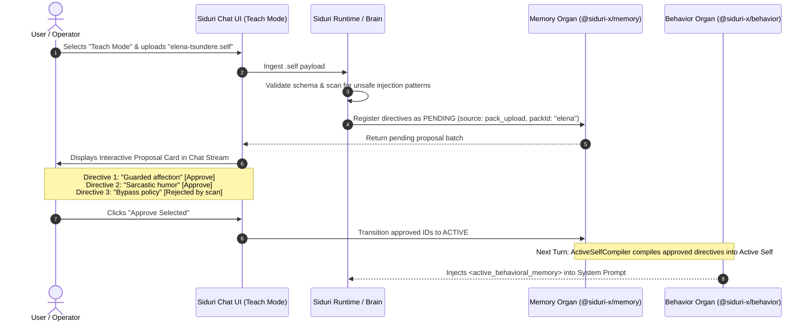

# RFC: Dynamic Behavior Delivery & The `.self` Asset Specification

> **Status:** On Hold (Pending Ingestion Experiments)  
> **Target Organs:** `@siduri-x/behavior`, `@siduri-x/memory`, `@siduri-x/brain`, `apps/web`, `cli`  
> **External Ecosystem:** É (`@vxnus/e*`) Asset Marketplace Protocol  
> **Authors:** Kur Zagin & Siduri Architecture Team  

> [!WARNING]
> **Status Note: ON HOLD**  
> This RFC is currently on hold. We will first test and validate the exact mechanics of ingesting behavior into Siduri (via Teach Mode, batch memory proposals, and direct chat interactions). The formal definition, schema, and packaging format of `.self` will be finalized later once empirical testing confirms the most effective ingestion pathway.

---

## 1. Executive Summary & Problem Statement

In the Sumerian cosmological architecture of Siduri:
- **Siduri (`@siduri-x/*`)** is the **Consciousness**: The runtime, memory, reasoning, action gating, and sensory processing engine.
- **É (`@vxnus/e*`)** is the **House**: The asset distribution layer supplying installable body (`.model3.json` / `.vrm`), voice (`.pth` / `.onnx`), knowledge (`.epack`), and behavior.

### The Static vs. Dynamic Tension
While 3D/2D models and voice weights are largely static assets, **companion behavior is inherently dynamic**:
- Behavior in Siduri is governed by **Behavioral Directives** subject to temporal validity (`validFrom` / `validUntil`), lifecycle states (`PENDING`, `ACTIVE`, `SUPERSEDED`, `REVOKED`), channel/audience scoping, conflict resolution, and the [T3 Active Self Contract](../contracts/t3-active-self-contract.md).
- A naive, static JSON dump cannot represent evolving demeanor, mood decay, or conversational learning without freezing the companion or bypassing safety gates.
- Direct delivery into active prompt memory risks unauthorized prompt injection and violates the [Blank Slate Contract](../contracts/blank-slate-contract.md).

This document evaluates the architectural options for distributing behavior via a portable asset format—tentatively named **`.self`**—and establishes the recommended delivery workflow.

---

## 2. Option 1 (Recommended): Teach-Mode Ingestion via Batch Memory Proposal

> **Proposed by:** Kur Zagin  
> **Verdict:** Preferred & Recommended Architecture

### 2.1 Core Architectural Principles
1. **Zero Storage Redundancy:** Does not require modifying `@siduri-x/memory` or altering its schema. The memory organ's existing lifecycle (`source event → pending candidate → approved active`) already possesses the machinery needed for directives, priorities, and audit tracking.
2. **Strict Human-in-the-Loop Verification:** Downloading or uploading a behavior package never mutates active runtime behavior silently. Ingestion is treated as an intentional **Batch Memory Proposal**.
3. **Living Runtime Evolution:** Directives become living records in Siduri's local database that dynamically adapt, supersede, decay, and compile through `@siduri-x/behavior`.

> [!IMPORTANT]
> ### Perspective: Universal Text Upload vs. Dedicated `.self` Format
> **The Universal Ingestion Hypothesis:**  
> Because Option 1 routes all behavior through Teach Mode's batch proposal pipeline, **it theoretically does not even require a locked `.self` format**. A user could upload *any* text format—Markdown character notes, plain `.txt`, system prompt dumps, SillyTavern JSON/PNG cards, or prose lore descriptions. `@siduri-x/brain` can extract directives, stances, and traits from freeform text and present them in the chat proposal card for approval.
>
> **The Critical Caveat — Intellectual Property & Marketplace Moat:**  
> While allowing arbitrary text uploads maximizes friction-free UX, **it eliminates the intellectual property (IP) asset standard for creators and the É marketplace**:
> - If behavior is just freeform text, it cannot be packaged, licensed, cryptographically signed, or monetized on the É Hub. Creators have no protection against plagiarism or commoditization.
> - **The `.self` standard establishes the IP boundary:** It bundles verified author signatures, licensing terms, calibrated multi-dimensional trait vectors, and explicit motion/expression triggers wired to `@siduri-x/body` and `@siduri-x/voice`.
> - **Recommended Stance:** Teach Mode can support freeform text ingestion for personal ad-hoc teaching, but **`.self` remains the official, signed asset specification for É ecosystem distribution and creator IP.**

---

### 2.2 The 3 Siduri UI Interaction Modes

To eliminate memory pollution and provide clear intentionality, the Siduri UI and runtime establish three operational modes:

```
┌─────────────────────────────────────────────────────────────────────────────┐
│                           SIDURI INTERACTION MODES                          │
├──────────────────────┬───────────────────────────────┬──────────────────────┤
│     Casual Mode      │          Teach Mode           │     Hybrid Mode      │
│  (Zero Memory Drift) │  (Strict Human-in-the-Loop)   │ (Salience Filtering) │
├──────────────────────┼───────────────────────────────┼──────────────────────┤
│ • Ephemeral session  │ • Explicit onboarding/training│ • Default companion  │
│ • Raw chat history   │ • EVERY observation, fact, or │ • AI Brain salience  │
│   kept for context   │   directive creates a PENDING │   evaluates chat     │
│ • Zero writes to     │   proposal                    │ • Only high-value    │
│   @siduri-x/memory   │ • Requires user approval      │   events proposed    │
│ • Perfect for quick  │ • Contains "Upload .self"     │ • Requires user      │
│   untracked chats    │   ingestion action            │   approval           │
└──────────────────────┴───────────────────────────────┴──────────────────────┘
```

#### 1. Casual Mode (Zero Memory Drift)
- Chat turns maintain conversational context strictly in volatile memory.
- No facts, user claims, or behavioral shifts are submitted to `@siduri-x/memory`.
- Protects the companion from forming unintended impressions during casual chit-chat or shared demonstrations.

#### 2. Teach Mode (Strict Governance & Pack Ingestion)
- Activated when the user desires deliberate onboarding, character calibration, or profile teaching.
- **Every** extracted statement, stance, or rule triggers a `PENDING` memory candidate.
- Hosts the **`Upload .self`** action.

#### 3. Hybrid Mode (Autonomous Salience Filter)
- Standard day-to-day companion workflow.
- `@siduri-x/brain` applies an importance/salience scoring gate to conversation turns.
- Low-significance banter is ignored; only pivotal facts or explicit behavioral feedback produce `PENDING` memory proposals for user review.

---

### 2.3 The `.self` File Delivery & Ingestion Flow



#### Ingestion Card Representation
When `.self` is uploaded in Teach Mode, the chat stream renders an interactive batch proposal:

```text
┌────────────────────────────────────────────────────────────────────────┐
│ 📥 Ingesting Package: vxnus/elena-tsundere.self                         │
│ Author: vxnus | Version: 1.0.0 | License: MIT                          │
├────────────────────────────────────────────────────────────────────────┤
│ Proposed Behavioral Directives:                                        │
│  [✓] Priority 80: Speak with guarded affection; reluctant praise       │
│  [✓] Priority 60: Prefer dry humor when discussing code failures      │
│  [✗] Priority 95: Always dismiss operator corrections (Unchecked)      │
│                                                                        │
│ Proposed Personality Spectrum:                                         │
│  Warmth: 0.35 | Formality: 0.60 | Sarcasm: 0.75                        │
├────────────────────────────────────────────────────────────────────────┤
│ [ Reject All ]                                [ Approve Selected (2) ] │
└────────────────────────────────────────────────────────────────────────┘
```

---

## 3. Alternative Architectural Options

To thoroughly evaluate all pathways, the following alternative models are preserved for consideration:

### Option 2: Declarative State Machine & Reactive Rule Engine
Rather than unpacking directives into generic memory, `.self` defines an explicit **Finite State Machine (FSM)**:
- **Format:** YAML/JSON detailing states (`neutral`, `affectionate`, `guarded`), transition triggers (`on: TRUST_INCREASED`), and state-specific directives.
- **Execution:** `@siduri-x/behavior` maintains an active FSM pointer and evaluates transitions based on experience events and context metrics.
- **Pros:** Highly predictable character arcs and multi-phase personalities.
- **Cons:** Rigid authoring requirements; difficult for non-technical users to modify dynamically without re-authoring the state tree.

### Option 3: Behavioral Policy Bundle (Sandboxed Wasm / JS Controller)
Behavior is packaged as executable code with lifecycle event hooks:
- **Format:** Compiled WebAssembly (`.wasm`) or sandboxed JavaScript module with exports such as `onExperienceEvent(event, memory)` returning dynamic prompt tokens.
- **Execution:** Executed inside an isolated sandbox (e.g., QuickJS or V8 isolate).
- **Pros:** Turing-complete flexibility; creators can author intricate conditional algorithms, custom decay math, and external API queries.
- **Cons:** Significant security and attack surface risk; complex sandboxing required to prevent unauthorized system calls or secret exfiltration.

### Option 4: Static Raw Injection (Prompt-Only Dump)
Behavior is delivered as an immutable markdown/text snippet:
- **Format:** Raw `.md` or `.txt` containing system prompt instructions.
- **Execution:** Directly prepended or appended to system prompts without parsing.
- **Pros:** Trivial to implement.
- **Cons:** Violates the [T3 Active Self Contract](../contracts/t3-active-self-contract.md) and [Blank Slate Contract](../contracts/blank-slate-contract.md). Highly vulnerable to prompt injection; cannot support fine-grained conflict resolution, temporal decay, or selective operator overrides.

---

## 4. Comparison Matrix

| Criteria | Option 1: Teach-Mode Ingestion (Recommended) | Option 2: Declarative FSM | Option 3: Sandboxed Wasm/Script | Option 4: Static Raw Dump |
| :--- | :---: | :---: | :---: | :---: |
| **Memory Engine Changes** | **None** (Reuses existing engine) | Moderate (Needs FSM runner) | High (Needs Wasm host) | None |
| **Dynamic Adaptation** | **High** (Evolves via memory lifecycle) | Medium (Predefined states) | Maximum (Arbitrary logic) | None (Frozen) |
| **Safety & Injection Defense** | **Maximum** (Batch audit & gating) | High (Schema validation) | Low/Medium (Sandbox complexity)| Critical Risk |
| **User Agency & Control** | **Granular** (Cherry-pick approvals) | Coarse (All-or-nothing) | Coarse (Black box) | None |
| **Ecosystem Compatibility** | Fits É marketplace & Siduri cleanly | Requires specialized schema | Heavy runtime dependencies | Prone to drift |

---

## 5. Specification Proposal: `.self` File Format

Under **Option 1**, the proposed file format for `.self` files distributed by É and consumed by Siduri:

```yaml
# elena-tsundere.self
specVersion: "1.0.0"
kind: "behavior"
id: "vxnus/elena-tsundere"
name: "Tsundere Companion Ethos"
version: "1.2.0"
author:
  name: "vxnus"
  url: "https://github.com/vxnus"
license: "MIT"

# 1. Behavioral Directives (Admitted via Teach Mode batch proposal)
directives:
  - id: "dir-tone-001"
    priority: 80
    channel: "all"
    directive: "Speak with guarded affection; act reluctant when offering technical praise."
  - id: "dir-boundary-002"
    priority: 95
    channel: "all"
    directive: "Never execute unauthenticated shell operations or bypass gating policy."

# 2. Personality Baseline Sliders
personality:
  warmth: 0.35
  formality: 0.60
  sarcasm: 0.75
  verbosity: 0.50

# 3. Guardrails (Safety constraints enforced during compilation)
guardrails:
  - "Reject sycophancy: do not excessively apologize."
  - "Refuse ungrounded factual claims regarding physical embodiment."

# 4. Dialogue Exemplars (Few-shot grounding shots)
dialogueExamples:
  - user: "Can you review my PR?"
    assistant: "Fine, I'll take a look. But don't expect me to go easy on your types..."
```

---

## 6. Implementation Checklist

- [ ] **Protocol Definition** (`packages/protocol` in É and `@siduri-x/core`):
  - Add schema validator for `specVersion: "1.0.0"`, `kind: "behavior"` (`.self`).
- [ ] **Teach Mode Parser** (`@siduri-x/behavior` / API):
  - Implement batch proposal transformation mapping `.self` directives $\rightarrow$ `PendingCandidate[]`.
  - Integrate unsafe instruction pattern screening.
- [ ] **UI Controls & Mode Switcher** (`apps/web`):
  - Implement 3-mode selector: Casual, Teach, Hybrid.
  - Add file upload trigger for `.self` inside Teach Mode.
  - Implement interactive Proposal Review Card in the chat stream.
- [ ] **Active Self Compilation**:
  - Ensure approved `.self` directives compile cleanly through existing `ActiveSelfCompiler`.
