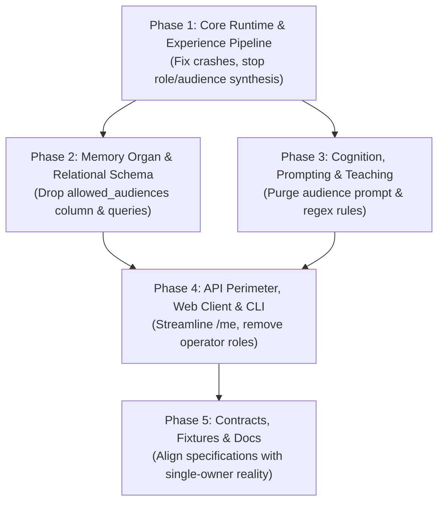

# Phased Migration Plan: Single-Owner Single-Machine Architecture

> **Status**: Completed (Historical Reference)  
> **Note**: This roadmap guided the initial removal of multi-audience RBAC columns from PostgreSQL. All PostgreSQL dependencies have since been purged in favor of unified Pure SQLite (`siduri.sqlite`). See [03-phased-migration-plan.md](../self-organ-knowledge/03-phased-migration-plan.md) for the canonical architecture migration.  
> **Target**: Completely eliminate remaining assumptions, data types, database schemas, prompt instructions, and UI partitions of the legacy multi-audience and internal RBAC (`VIEWER` / `OPERATOR` / `OWNER`) mental model across `@siduri-x`.

---

## Executive Summary

Commit `becfed9` (*feat(security): enforce single-owner single-machine external boundary security model*) established the external boundary security philosophy:
* Siduri is a personal, single-owner companion running on a single machine.
* Security perimeter is the machine boundary (external network vs. local loopback).
* Internal RBAC hierarchies (`VIEWER`, `OPERATOR`, `OWNER`) and audience isolation (`audienceId`, `allowedAudiences`, `audience-public`) are obsolete.

However, an extensive audit revealed that the internal nervous system of Siduri remains tightly coupled to the old mental model. The legacy concepts are actively synthesized in core dispatchers, validated in event handlers, stored in PostgreSQL columns, filtered in evidence engines, instructed in LLM prompts, and mandated in 5 out of 7 formal contracts.

This phased plan details the discrete, low-risk engineering steps to systematically purge the old mental model and achieve architectural purity.



---

## Phase 1: Core Runtime & Experience Pipeline Uncoupling (`packages/core`)

**Goal**: Eliminate runtime failure modes and stop synthesizing artificial roles/audiences in core dispatching and safety evaluation.

### 1.1 Remove Mandatory Audience Validation in Experience Events
* **File**: [`packages/core/src/experience.ts`](file:///root/projects/vxnus-studio/siduri-x/packages/core/src/experience.ts#L125)
* **Problem**: `validateExperienceEvent` throws a fatal error if `audienceId` is missing:
  ```ts
  if (!e.audienceId || typeof e.audienceId !== 'string') return { valid: false, error: 'Missing or invalid audienceId' };
  ```
* **Action**:
  - Remove mandatory check for `e.audienceId` in `validateExperienceEvent`.
  - Mark `audienceId?: string` as `@deprecated` in `ExperienceEvent` and `CreateExperienceEventsOptions`.
  - Update [`packages/core/src/experience.test.ts`](file:///root/projects/vxnus-studio/siduri-x/packages/core/src/experience.test.ts) to verify events succeed without `audienceId`.

### 1.2 Preserve RequestContext in Chat Dispatcher
* **File**: [`packages/core/src/chat-contract.ts`](file:///root/projects/vxnus-studio/siduri-x/packages/core/src/chat-contract.ts#L96-L110)
* **Problem**: `dispatchCompanionChat` inspects `payload.context.actor?.authorizationRole` and collapses the context down to a legacy string (`'OWNER' | 'VIEWER' | 'OPERATOR'`) before invoking `runtime.handleUserMessage`.
* **Action**:
  - Pass `payload.context` directly as `roleOrContext` into `runtime.handleUserMessage`.
  - Deprecate `payload.role`.

### 1.3 Clean Input Normalizer Synthesis
* **File**: [`packages/core/src/input-normalizer.ts`](file:///root/projects/vxnus-studio/siduri-x/packages/core/src/input-normalizer.ts#L36-L60)
* **Problem**: When given a string or missing context, `normalizeUserInput` synthesizes `audience-direct-owner` vs `audience-public`, assigns `authorizationRole`, and partitions capabilities based on whether role is `'OWNER'` or `'VIEWER'`.
* **Action**:
  - Unify synthetic fallback context: authenticated single owner with full capability set (`['chat', 'memory:approve', 'action:execute']`), `channel: 'direct'`, and no synthetic audience.
  - Simplify `NormalizedInput.role` to be optional or deprecated.

### 1.4 Response Gating & Evidence Disclosure Purification
* **Files**: [`packages/core/src/gating.ts`](file:///root/projects/vxnus-studio/siduri-x/packages/core/src/gating.ts#L75-L215), [`packages/core/src/evidence.ts`](file:///root/projects/vxnus-studio/siduri-x/packages/core/src/evidence.ts#L115-L138)
* **Problem**:
  - `stageResponse` triggers `requiresApproval` if `channel === 'operator'`.
  - `approveResponse` rejects with `'AUDIENCE_MISMATCH'`.
  - `filterEvidenceRecords` executes audience intersection and channel sensitivity exclusion (`sensitivity_private_in_public_channel`).
* **Action**:
  - Base `requiresApproval` strictly on intrinsic evidence trust (OCR, untrusted origin) and tool action risk, not `channel === 'operator'`.
  - Remove `AUDIENCE_MISMATCH` rejection in `approveResponse`.
  - Remove `allowedAudiences` filtering loop and channel sensitivity masking in `filterEvidenceRecords`. Memory and evidence in a single-owner companion are partitioned only by companion boundary (`companionId`) and expiration.

### 1.5 Purge RBAC from Action Policy Engine
* **Files**: [`packages/core/src/action-policy.ts`](file:///root/projects/vxnus-studio/siduri-x/packages/core/src/action-policy.ts#L124-L164), [`packages/core/src/action.ts`](file:///root/projects/vxnus-studio/siduri-x/packages/core/src/action.ts#L85-L86)
* **Problem**: `toolDef.allowedRoles` and `toolDef.allowedChannels` evaluate internal RBAC roles, rejecting calls with `REJECTED_UNAUTHORIZED`.
* **Action**:
  - Remove `allowedRoles` and `allowedChannels` checks.
  - Gate actions strictly on: (1) Machine boundary authentication (`effectiveContext.actor.authenticated`), (2) Tool registration, (3) Risk-level explicit approval, (4) Required capability tags.

### 1.6 Fix Type Signatures in Core Runtime
* **File**: [`packages/core/src/runtime.ts`](file:///root/projects/vxnus-studio/siduri-x/packages/core/src/runtime.ts#L251)
* **Action**:
  - Remove `'allowedAudiences'` from `updateClaim` parameter Pick type to restore strict consistency with `Claim`.
  - Align `MemoryScope` usage in `memory-settler.ts` with `'companion' | 'user'`.

---

## Phase 2: Memory Organ & Relational Schema Modernization (`packages/organs/memory`)

**Goal**: Remove multi-audience columns from PostgreSQL and strip legacy audience parameters from the memory organ API.

### 2.1 Database Schema Migration
* **Files**: [`packages/organs/memory/migrations/001_initial_schema.sql`](file:///root/projects/vxnus-studio/siduri-x/packages/organs/memory/migrations/001_initial_schema.sql), [`packages/organs/memory/src/schema.ts`](file:///root/projects/vxnus-studio/siduri-x/packages/organs/memory/src/schema.ts)
* **Action**:
  - Add migration script `002_drop_allowed_audiences.sql` to alter `memory_claims DROP COLUMN IF EXISTS allowed_audiences`.
  - Update `schema.ts` to remove `allowed_audiences JSONB`.
  - Remove automatic column creation `ADD COLUMN IF NOT EXISTS allowed_audiences` in `index.ts`.

### 2.2 PostgresMemoryOrgan Implementation Clean-Up
* **File**: [`packages/organs/memory/src/index.ts`](file:///root/projects/vxnus-studio/siduri-x/packages/organs/memory/src/index.ts)
* **Action**:
  - In `proposeClaim`, remove `$14 (allowed_audiences)` parameter from SQL query.
  - In `mapClaim`, remove `allowedAudiences: row.allowed_audiences`.
  - In `updateClaim`, remove audience update logic (`newAudiences`, `allowed_audiences = $11`).
  - In `searchClaims`, remove `audienceId` parameter and unused channel parsing.

### 2.3 Memory Test Suite Refactor
* **Files**:
  - [`packages/organs/memory/src/disclosure.test.ts`](file:///root/projects/vxnus-studio/siduri-x/packages/organs/memory/src/disclosure.test.ts)
  - [`packages/organs/memory/src/m2-m3.test.ts`](file:///root/projects/vxnus-studio/siduri-x/packages/organs/memory/src/m2-m3.test.ts)
  - [`packages/organs/memory/src/index.test.ts`](file:///root/projects/vxnus-studio/siduri-x/packages/organs/memory/src/index.test.ts)
* **Action**:
  - Remove tests asserting `allowedAudiences` inclusion (`'audience-direct-actor-river'`, `'audience-public'`).
  - Convert `disclosure.test.ts` to test single-owner claim retrieval, temporal bounds, and companion isolation.

---

## Phase 3: Cognition, Prompting & Teaching Purification (`packages/organs/brain`, `packages/organs/behavior`, `packages/core`)

**Goal**: Purge audience and operator assumptions from the AI's prompts, deterministic teaching rules, and behavioral compilation.

### 3.1 Brain Organ System Prompt Purge
* **File**: [`packages/organs/brain/src/prompt.ts`](file:///root/projects/vxnus-studio/siduri-x/packages/organs/brain/src/prompt.ts#L13)
* **Problem**: The system prompt injected into the LLM explicitly states:
  > *"They never override privacy, **audience restrictions**, evidence requirements, **operator approval**, or tool permissions."*
* **Action**:
  - Update to:
    > *"They never override privacy, evidence requirements, owner approval, or tool permissions."*

### 3.2 Deterministic Teaching Scope Simplification
* **File**: [`packages/core/src/teaching.ts`](file:///root/projects/vxnus-studio/siduri-x/packages/core/src/teaching.ts#L84-L118)
* **Problem**: Teaching parses *"call me X in private"* vs *"publicly"* vs *"in direct conversations"* and segregates claims into audience slices.
* **Action**:
  - A preference taught to a personal companion applies to the companion instance.
  - Simplify teaching extraction to set `subject: actor:${actorId}` (or `companion:${companionId}`) without audience partitioning.
  - Drop `allowedAudiences` from `MemoryProposal`.

### 3.3 Behavior Organ Clean-Up
* **File**: [`packages/organs/behavior/src/index.ts`](file:///root/projects/vxnus-studio/siduri-x/packages/organs/behavior/src/index.ts#L9)
* **Action**:
  - Remove unused destructuring of `activeRole`, `channel`, and `audienceId` from `ActiveSelfCompiler.compileProjection`.

---

## Phase 4: API Perimeter, Web Client & CLI Consolidation (`apps/api`, `apps/web`, `cli/`)

**Goal**: Streamline authentication, fix the `/me` endpoint, remove legacy role headers, and update client templates.

### 4.1 API Identity & Middleware Streamlining
* **Files**: [`apps/api/src/auth.ts`](file:///root/projects/vxnus-studio/siduri-x/apps/api/src/auth.ts), [`apps/api/src/app.ts`](file:///root/projects/vxnus-studio/siduri-x/apps/api/src/app.ts)
* **Action**:
  - In `auth.ts`, eliminate `OPERATOR_TOKEN` and deprecate `Role = 'OWNER' | 'OPERATOR' | 'VIEWER'`.
  - Deprecate `requireRole` middleware; enforce all perimeter authorization via `requireAuth`.
  - In `app.ts`, simplify `GET /me`:
    ```ts
    app.get('/me', attachIdentity, (req, res) => {
      const identity = (req as any).identity as Identity;
      res.json({
        actorId: identity.actorId || 'owner-user',
        authenticated: Boolean(identity.authenticated),
        source: identity.source || 'local',
      });
    });
    ```
  - In `POST /dev/approve-response`, remove `audienceId` parameter.

### 4.2 Web Client Refactor (`apps/web`)
* **Files**:
  - [`apps/web/src/app/chat/chat-client.tsx`](file:///root/projects/vxnus-studio/siduri-x/apps/web/src/app/chat/chat-client.tsx#L305)
  - [`apps/web/src/lib/memory-display.ts`](file:///root/projects/vxnus-studio/siduri-x/apps/web/src/lib/memory-display.ts#L14)
  - [`apps/web/src/app/operator/operator-client.tsx`](file:///root/projects/vxnus-studio/siduri-x/apps/web/src/app/operator/operator-client.tsx)
* **Action**:
  - Remove `role: "OWNER"` payload from `chat-client.tsx`.
  - In `memory-display.ts`, purge `master`, `master_private`, and `primary_user` from `USER_SUBJECTS`. Clean `"User role configured as..."` formatting.
  - Re-align `/operator` into a developer/admin companion inspector; remove `allowed_audiences`.

### 4.3 CLI Template Modernization
* **File**: [`cli/src/generator.ts`](file:///root/projects/vxnus-studio/siduri-x/cli/src/generator.ts#L407-L446)
* **Action**:
  - Remove hardcoded `role: payload.role || 'OWNER'` from generated server templates.

---

## Phase 5: Contracts, Specifications & Documentation Alignment (`docs/`)

**Goal**: Bring the entire documentation corpus into 100% harmony with the single-owner external boundary reality.

### 5.1 Supersede T2 Memory Disclosure Matrix
* **File**: [`docs/contracts/t2-memory-disclosure-matrix.md`](file:///root/projects/vxnus-studio/siduri-x/docs/contracts/t2-memory-disclosure-matrix.md)
* **Action**:
  - Replace the multi-audience matrix with single-owner retrieval rules: all approved claims for the active `companionId` are accessible to the owner; filter only on companion isolation and temporal validity.

### 5.2 Modernize Dependent Contracts
* **Files**:
  - [`docs/contracts/t3-active-self-contract.md`](file:///root/projects/vxnus-studio/siduri-x/docs/contracts/t3-active-self-contract.md): Remove `authorizationRole` and audience filtering.
  - [`docs/contracts/t4-evidence-chain-contract.md`](file:///root/projects/vxnus-studio/siduri-x/docs/contracts/t4-evidence-chain-contract.md): Remove audience intersection from disclosure steps.
  - [`docs/contracts/t5-experience-event-contract.md`](file:///root/projects/vxnus-studio/siduri-x/docs/contracts/t5-experience-event-contract.md): Make `audienceId` optional or removed.
  - [`docs/contracts/t6-security-operations-contract.md`](file:///root/projects/vxnus-studio/siduri-x/docs/contracts/t6-security-operations-contract.md): Replace the 4-tier actor matrix with the external machine boundary security model.
  - [`docs/contracts/t1-api-contract-examples.md`](file:///root/projects/vxnus-studio/siduri-x/docs/contracts/t1-api-contract-examples.md): Update synthetic payloads to reflect clean RequestContext envelopes.

### 5.3 Synchronize Architecture Documentation
* **Files**:
  - [`docs/architecture/companion-runtime.md`](file:///root/projects/vxnus-studio/siduri-x/docs/architecture/companion-runtime.md)
  - [`docs/architecture/behavior.md`](file:///root/projects/vxnus-studio/siduri-x/docs/architecture/behavior.md)
  - [`docs/architecture/truth-gate.md`](file:///root/projects/vxnus-studio/siduri-x/docs/architecture/truth-gate.md)
  - [`docs/architecture/action-policy-design.md`](file:///root/projects/vxnus-studio/siduri-x/docs/architecture/action-policy-design.md)
  - [`docs/contracts/neutral-terminology-glossary.md`](file:///root/projects/vxnus-studio/siduri-x/docs/contracts/neutral-terminology-glossary.md)
* **Action**:
  - Update all diagrams and stage descriptions to remove legacy multi-audience disclosure and role filtering references.

---

## Verification & Acceptance Criteria

Each phase must be verified by targeted tests and end-to-end integration:

1. **Clean Envelope Test**: An HTTP chat request with `{ companionId: "test", message: "Hello" }` (no `role`, no `audienceId`, no `capabilities`) succeeds through perception, memory retrieval, brain cognition, response gating, and experience emission without errors or diagnostic warnings.
2. **Experience Event Validation**: `validateExperienceEvent` passes cleanly on events without an `audienceId`.
3. **Database Integrity**: PostgreSQL `memory_claims` stores and retrieves claims without the `allowed_audiences` column.
4. **Cognitive Integrity**: Brain system prompt contains no instructions regarding "audience restrictions" or "operator approval".
5. **No Collapsing to Roles**: `dispatchCompanionChat` preserves modern `RequestContext` without converting to `'OWNER'` / `'VIEWER'`.
