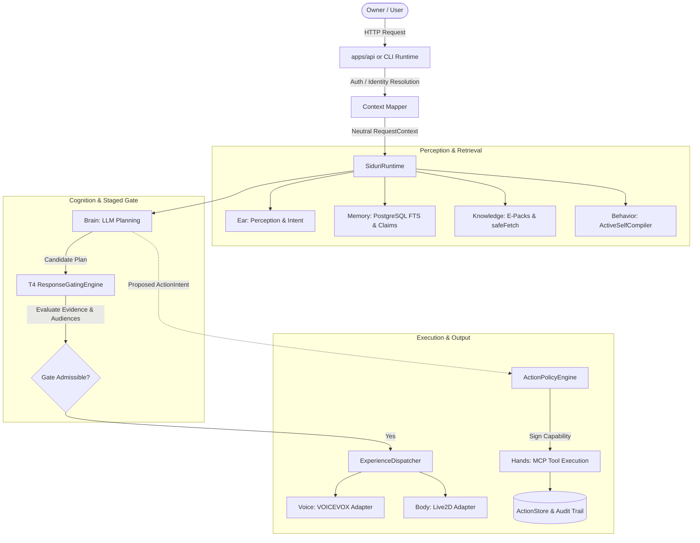

# Concrete Architecture & Organ Boundaries

## Architecture Diagram

---

## Organ Responsibilities

1. **`@siduri-x/core` (`SiduriRuntime`)**:
   - Master orchestrator connecting perception, context resolution, active self compilation, cognitive planning, response gating, action policy evaluation, and multi-modal experience dispatch.
2. **`@siduri-x/memory` (`PostgresMemoryOrgan`)**:
   - Persistent PostgreSQL store for semantic claims, historical changes, source events, and behavioral directives. Supports PostgreSQL Full-Text Search (`to_tsvector` / `to_tsquery`), audience isolation, temporal validity, and confidence thresholding.
3. **`@siduri-x/brain` (`OpenRouterBrain` / `OpenAICompatibleBrain`)**:
   - Generates candidate dialogue and tool intents given the compiled system prompt and retrieved context.
4. **`@siduri-x/knowledge` (`EKnowledgeAdapter`)**:
   - Retrieves structured knowledge and documentation from local E-Packs or remote E-Hub endpoints with SSRF-hardened network fetching.
5. **`@siduri-x/hands` (`DefaultHandsOrgan`)**:
   - Executes system and external tools only after verifying an HMAC-signed `AuthorizationCapability` issued by the `ActionPolicyEngine`.
6. **`@siduri-x/voice` & `@siduri-x/body`**:
   - Consumes approved `ExperienceEvent` stream from `ExperienceDispatcher` to drive text-to-speech audio and visual avatar expressions.
