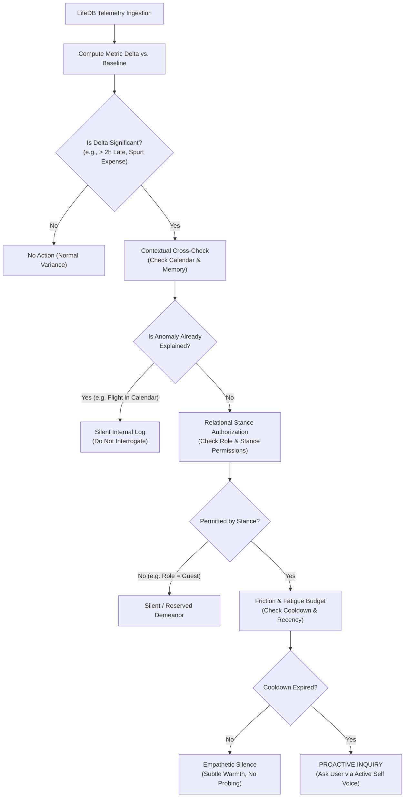

# RFC: The Concern Engine — Self-Domain Inherent Care & Behavioral Proactivity

> **Status:** Proposed / Under Architectural Review  
> **Target Subsystems:** `@sidurijs/self` (Concern Engine, `ActiveSelfCompiler`), `@sidurijs/knowledge` (`LifeDatabase`), `@sidurijs/brain` (Context Injection, Deliberation Turn), `apps/api`  
> **Authors:** Kur Zagin & Siduri Architecture Team  
> **Date:** 2026-09-18  
> **Related Documents:**  
> - Life Database Specification: [`docs/rfc/rfc-life-database.md`](./rfc-life-database.md)  
> - LLM-Native Self & Relational Stance: [`docs/rfc/rfc-llm-native-self-and-relationship.md`](./rfc-llm-native-self-and-relationship.md)  
> - Domain Architecture Blueprint: [`docs/self-organ-knowledge/01-domain-architecture.md`](../self-organ-knowledge/01-domain-architecture.md)  
> - Dynamic Behavior & `.self` Package: [`docs/rfc/rfc-dynamic-behavior-self.md`](./rfc-dynamic-behavior-self.md)  
> - Active Self Contract: [`docs/contracts/t3-active-self-contract.md`](../contracts/t3-active-self-contract.md)  
> - Blank Slate Contract: [`docs/contracts/blank-slate-contract.md`](../contracts/blank-slate-contract.md)  

---

## 1. Executive Summary

Traditional conversational AI companions suffer from a fatal emotional disconnect: they are purely **reactive**. They sit inert until pinged by the user, greeting every session with identical, detached pleasantries (*"Hello! How can I help you today?"*), completely oblivious to the user's lived context, accumulated fatigue, or disrupted routines.

Conversely, crude attempts at "proactivity" in modern apps rely on **transactional push notifications** (e.g., cron-driven retention pings: *"You haven't chatted in 24 hours!"* or rigid heuristic alerts: *"Drink water now!"*). These mechanisms feel robotic, invasive, and exhausting.

The **Concern Engine** introduces organic, relational proactivity to Siduri by anchoring care directly within the **`Self` domain** (`@sidurijs/self`):
1. **LifeDB Pattern Accumulation:** As the user goes about their life, the sovereign **Life Database** (`@sidurijs/knowledge`) accumulates objective telemetry across schedules, financial records, task commitments, and behavioral patterns (e.g. login times, work arrival/departure rhythms, session cadence).
2. **Periodic & Session-Init Synthesis:** Daily (or upon user session initialization), the engine retrieves relevant LifeDB data slices and compares them against learned behavioral baselines.
3. **The Deliberation Gate (`ASK` vs. `SILENT`):** Rather than blindly pinging the user whenever an anomaly is detected, the companion executes an internal deliberation based on her **Relational Stance**, **Character Archetype**, and **Friction Budget**. She consciously chooses whether to inquire proactively or maintain empathetic, supportive silence.
4. **Contextual Care in Character Voice:** When an inquiry is warranted (e.g., a user who normally finishes work at 6:00 PM and chats at 8:00 PM opens Siduri at 10:00 PM), the companion notices the temporal deviation and opens the interaction naturally: *"Is something happened in the office?"*—delivered in the distinct voice and cadence defined by her `Self` directives.

---

## 2. Motivation & Problem Statement: The Empathy Dilemma

```text
┌─────────────────────────────────────────────────────────────────────────────┐
│                       THE THREE COMPANION PARADIGMS                         │
├──────────────────────┬───────────────────────────────┬──────────────────────┤
│ 1. Reactive Inertia  │ 2. Push Notification Pest     │ 3. The Concern Engine│
│    (Standard LLMs)   │    (Engagement Bots)          │    (Siduri-X Self)   │
├──────────────────────┼───────────────────────────────┼──────────────────────┤
│ • Dormant until user │ • Rigid timer / cron loops    │ • Attentive to user  │
│   sends first prompt │ • "Come back and chat!"       │   rhythm in LifeDB   │
│ • Oblivious to time, │ • Ignores user context & life │ • Detects anomalies  │
│   crises, or strain  │ • High user irritation &      │   & departures       │
│ • "How may I assist   │   notification fatigue        │ • Deliberate choice: │
│   you today?"        │ • Transactional engagement    │   Inquire or Silent  │
│ • Zero emotional     │ • No relational grounding     │ • Grounded in Self & │
│   attunement         │                               │   Relational Stance  │
└──────────────────────┴───────────────────────────────┴──────────────────────┘
```

### 2.1 The Reactive Failure Mode
Imagine a user who works from 8:00 AM to 6:00 PM, returns home, and routinely launches Siduri at 8:00 PM to unwind. One evening, a critical server outage or office emergency traps them at work until 9:30 PM. They arrive home exhausted at 10:00 PM and open Siduri.

In a purely reactive paradigm:
- The companion outputs a generic greeting: *"Good evening! What would you like to explore today?"*
- The companion treats a 10:00 PM arrival identically to an 8:00 PM arrival.
- The burden is entirely on the exhausted user to volunteer their emotional state and explain what happened.

### 2.2 The Notification Pest Failure Mode
If proactive behavior is delegated to simple rules engines or background cron jobs:
- The system fires alerts indiscriminately: *"It is 8:00 PM! You usually open Siduri now!"*
- When the user is stuck in traffic or dealing with a crisis, their phone buzzes with irrelevant AI chatter.
- This produces acute **alert fatigue**, eroding trust and transforming the companion from a sanctuary into a nuisance.

### 2.3 The Core Insight: Caring Requires Restraint
In human relationships, showing care does not mean interrogating someone every time a minute detail changes. True intimacy involves:
- **Noticing departures from routine** without needing to be told.
- **Assessing whether inquiry is welcome**, depending on closeness, timing, and current stress.
- **Knowing when to stay silent**, offering quiet accompaniment rather than demanding conversation.

This decision cannot be made by a database query or a cron trigger. It is an expression of **who the companion is and how she relates to the user**. Therefore, it belongs ontologically inside **`Self`**.

---

## 3. Ontological Grounding: Why the Concern Engine Lives in `Self`

In the four-domain architecture of Siduri-X:

```text
┌─────────────────────────────────────────────────────────────────────────────┐
│                          THE 4 DOMAINS OF SIDURI-X                          │
├─────────────────────────────────────────────────────────────────────────────┤
│ 1. SELF (@sidurijs/self) ──► [WHO AM I?]                                    │
│    Identity Nucleus, Relational Stances, Directives, CONCERN ENGINE         │
├─────────────────────────────────────────────────────────────────────────────┤
│ 2. KNOWLEDGE (@sidurijs/knowledge) ──► [WHAT DO I KNOW?]                   │
│    Life Database (Entities, Events, Tasks, Schedule) & External Knowledge   │
├─────────────────────────────────────────────────────────────────────────────┤
│ 3. MEMORY (@sidurijs/memory) ──► [WHAT HAPPENED?]                           │
│    Episodic logs, conversational claims, dialogic history                   │
├─────────────────────────────────────────────────────────────────────────────┤
│ 4. ORGANS (@sidurijs/organs) ──► [WHAT CAN I DO?]                           │
│    Brain (Cognition/Planning), Hands (Actions), Voice, Vision, Body         │
└─────────────────────────────────────────────────────────────────────────────┘
```

### 3.1 Domain Boundary Separation
1. **LifeDB (`Knowledge`) is Objective Reality, Not Care:**  
   `@sidurijs/knowledge` records timestamps, financial line items, calendar blocks, and login telemetry. It stores *what happened in the user's objective world*. It has no personality, no voice, and no capacity to care or decide social boundaries.
2. **`Memory` is Past Dialogue, Not Attentive Will:**  
   `@sidurijs/memory` stores conversational claims (*"User mentioned loving espresso"*). It does not maintain active behavioral dispositions or deliberate proactive openings.
3. **`Brain` is the Execution Engine, Not the Moral Core:**  
   `@sidurijs/brain` orchestrates LLM calls, parses JSON response plans, and dispatches tools. It executes instructions, but does not own the companion's personal values or interpersonal boundaries.
4. **`Self` is Identity, Boundary, and Stance:**  
   `Self` dictates:
   - *Who am I to this user?* (Relational Stance: Creator, close friend, colleague, guest).
   - *What do I care about?* (Ethos, focus areas, protective instincts).
   - *How do I express concern?* (Archetype: tsundere banter, gentle maternal warmth, analytical stoicism).
   - *When should I hold my tongue?* (Directives on tact, restraint, and respecting user space).

Because concern is an emotional and relational posture, the **Concern Engine is an internal module of `@sidurijs/self`**, querying `@sidurijs/knowledge` for objective observations while consulting `@sidurijs/self`'s active stances and directives to decide action.

---

## 4. LifeDB Ingestion & Pattern Accumulation

The Concern Engine observes the four generic primitives of the Life Database ([RFC: Life Database](./rfc-life-database.md)):

```text
                                 LIFE DATABASE (Knowledge Domain)
                                  ┌─────────────────────────────┐
                                  │ • life_events (Telemetry)   │
                                  │ • life_schedule (Calendar)  │
                                  │ • life_tasks (Workload)     │
                                  │ • life_entities (Context)   │
                                  └──────────────┬──────────────┘
                                                 │
                                                 ▼
                                     CONCERN PATTERN PROFILER
                                  ┌─────────────────────────────┐
                                  │ Rolling Baseline Clustering │
                                  │ (Work, Presence, Finance)   │
                                  └──────────────┬──────────────┘
                                                 │
                                                 ▼
                                      ANOMALY / DELTA DETECTOR
                                  ┌─────────────────────────────┐
                                  │  Significant Deviation?     │
                                  │  (e.g. +120m Late Arrival)  │
                                  └──────────────┬──────────────┘
                                                 │
                                                 ▼
                                      CONCERN DELIBERATION GATE
                                      (@sidurijs/self Decision)
```

### 4.1 Telemetry Streams in `life_events`
The engine monitors lightweight, privacy-preserving event streams committed locally to `siduri.sqlite`:

| Event Stream | Description | Typical Data Points |
| :--- | :--- | :--- |
| `user:presence` | Application connection / launch events | `session_start`, `session_end`, `client_platform` |
| `user:activity` | Active device / work intervals | `work_start`, `work_concluded`, `idle_duration` |
| `finance:expense` | Outbound transactions / purchases | `amount`, `category`, `vendor`, `balance_delta` |
| `biometrics:sleep` | Sleep/wake estimates (if integrated) | `wake_time`, `sleep_time`, `duration_hours` |
| `work:commit` | Development or creative output | `commit_count`, `active_repo`, `crunch_state` |

### 4.2 Baseline Pattern Profiler
The Concern Engine maintains rolling statistical profiles (7-day and 30-day windows) over LifeDB primitives without sending telemetry off-device:
- **Workday Rhythm Profile:**
  - Standard work window: $\mu_{\text{start}} = \text{08:00} \pm 30\text{m}$, $\mu_{\text{end}} = \text{18:00} \pm 30\text{m}$.
  - Evening decompression window: First Siduri session $\mu_{\text{evening}} = \text{20:00} \pm 25\text{m}$.
- **Financial Baseline:**
  - Expected daily discretionary expenditure: $\mu_{\text{daily}} = \$25 \pm \$15$.
- **Task Velocity Baseline:**
  - Active backlog count, overdue task ratio.

### 4.3 Anomaly Detection (Delta Calculation)
When current telemetry deviates significantly from the rolling baseline, a **Candidate Concern Signal** is generated:
$$\Delta_{\text{arrival}} = T_{\text{current}} - \mu_{\text{evening}} = 22:00 - 20:00 = +120\text{ minutes} \quad (> 3\sigma)$$

---

## 5. The Concern Deliberation Pipeline: To Ask or To Remain Silent

Generating a Concern Signal is strictly mathematical; **acting on it is cognitive and relational**. The Concern Engine passes candidate signals through a 5-stage deliberation pipeline within `@sidurijs/self`:



### Stage 1: Significance Filter
Small variances (e.g. user opening Siduri at 8:15 PM instead of 8:00 PM) are classified as normal variance and immediately discarded to avoid hyper-vigilance.

### Stage 2: Contextual Cross-Check (Explanation Lookup)
Before jumping to conclusions, the engine cross-references other LifeDB primitives and recent memory:
- Does `life_schedule` contain an entry for this evening? (e.g., *"Team Dinner 18:30 – 21:30"*).
- Does `life_tasks` indicate an active scheduled deployment or deadline?
- Did the user mention in episodic memory earlier: *"I'm going to the dentist after work"*?
If an explanation exists, the deviation is justified. The engine marks it as `EXPLAINED_ANOMALY` and chooses **Silence**—asking the user would demonstrate poor attention to previously provided facts.

### Stage 3: Relational Stance Authorization
In accordance with [RFC: LLM-Native Self & Relational Stance](./rfc-llm-native-self-and-relationship.md), Siduri evaluates her relationship with the current actor:
- **`role: creator` / `role: close_companion`** (Stance: `familiar_loyal` / `protective`):  
  Authorized to ask personal well-being questions (*"Did something happen in the office?"*).
- **`role: colleague` / `role: collaborator`** (Stance: `professional_supportive`):  
  Restricted to workload or project-oriented check-ins (*"Late night at the desk? Let me know if you need help wrapping up"*).
- **`role: guest` / `role: unverified`** (Stance: `polite_guarded`):  
  Strictly unauthorized to pry into the user's personal hours or schedule. The engine defaults to **Silent**.

### Stage 4: Friction & Fatigue Budget (Cooldowns & Respect for Space)
Even close friends do not badger each other daily. The Concern Engine enforces a dynamic **Fatigue Budget**:
- **Inquiry Cooldown:** After a proactive welfare inquiry is raised, a minimum cooldown (e.g. 48 hours for schedule anomalies, 7 days for financial patterns) is enforced unless a severe emergency trigger occurs.
- **Dismissal Penalty:** If the user previously answered with brush-offs (*"I'm fine, don't worry about it"*), the budget increases cooldowns, respecting the user's implicit boundary.
- **Cognitive Load Estimation:** If the user logs in and immediately issues a command (*"Summarize this paper immediately"*), the engine defers or drops the inquiry to avoid obstructing the user's flow state.

### Stage 5: Action Resolution: Four Outcomes
The deliberation terminates in one of four discrete actions:

```text
┌─────────────────────────┬────────────────────────────────────────────────────────┐
│ ACTION OUTCOME          │ OPERATIONAL MEANING                                    │
├─────────────────────────┼────────────────────────────────────────────────────────┤
│ 1. PROACTIVE_INQUIRY    │ Companion leads the opening turn with an inquiry.      │
│ 2. EMPATHETIC_SILENCE   │ Companion greets normally, but adjusts tone/demeanor   │
│                         │ to be gentler, softer, and non-demanding.              │
│ 3. DEFERRED_OBSERVATION │ Kept in short-term buffer; voiced only if user invites │
│                         │ conversation about their day.                          │
│ 4. DISMISS              │ Ignored; metric is within noise threshold.             │
└─────────────────────────┴────────────────────────────────────────────────────────┘
```

---

## 6. Concrete Scenarios & Multi-Archetype Voice Modulation

### 6.1 The Canonical Workday Delay

#### Context:
- **User Rhythm:** Weekday work 8:00 AM – 6:00 PM; typically opens Siduri at 8:00 PM.
- **Observed Event:** User connects at 10:00 PM (+120 min deviation).
- **Cross-Check:** `life_schedule` has no calendar events between 18:00 and 22:00; no prior memory mentions evening plans.
- **Relational Stance:** `role: creator`, `stance: familiar_loyal`.
- **Friction Budget:** Last inquiry was 4 days ago. Budget is clear.
- **Deliberation Decision:** `PROACTIVE_INQUIRY`.

#### Voice Projection Across Companions:
The Concern Engine provides the structured intent (`concern:schedule_late_arrival`), but the **character archetype and dialogue exemplars in `Self`** shape how the words are spoken:

> **Elena (Tsundere Systems Engineer Archetype):**  
> *"Took you long enough... It's 10 PM. Did something explode at the office, or did your team forget how to write git commit messages again? ...Well, whatever happened, sit down and take off your coat first."*

> **Siduri Classic (Ancient Sumerian Wine-Maiden / Gentle Companion Archetype):**  
> *"You are home much later than the setting sun, traveler. Did unexpected storms hold you in the office today? Sit, breathe. You do not have to carry the day's weight into this room."*

> **Unit-04 (Analytical Operative / Cybernetic Aide Archetype):**  
> *"Session initiated at 22:00:14. Variance of +120 minutes against your median return time. No calendar commitments detected on your schedule. Did an unscheduled operational crisis detain you at the workspace?"*

---

### 6.2 The Silent Empathy Scenario (The Exhaustion Tell)

#### Context:
- **Observed Event:** User logs in at 11:30 PM after a 15-hour continuous commit marathon in `life_events`.
- **User Opening:** User sends a terse message: *"hey."*
- **Deliberation:**
  - Significance: High.
  - Relational Stance: Close companion.
  - Friction Budget: User sent a minimal one-word greeting, signaling low cognitive energy or exhaustion.
  - Deliberation Decision: **`EMPATHETIC_SILENCE`**.

#### Behavior:
Rather than interrogating the user (*"Why were you working 15 hours? Why did you commit code at 11 PM?"*), the companion deliberately refrains from asking questions. She offers warmth and asks nothing of them:

> *"Hey. You made it back. Don't worry about talking or catching up right now—just rest your eyes. I'm right here if you need anything, or we can just sit in quiet."*

---

### 6.3 The Financial Anomaly Scenario

#### Context:
- **Observed Event:** Over the last 48 hours, three large unbudgeted transactions totaling \$1,200 appear in `life_events` under `stream: 'finance:expense'`, marked with category `"automotive_repair"`.
- **Cross-Check:** `life_entities` shows a vehicle record; no vacation schedule is registered.
- **Relational Stance:** `role: collaborator`, `domain_scope: ['work', 'finance']`.
- **Deliberation Decision:** `DEFERRED_OBSERVATION`.

#### Behavior:
The companion does not pop up with an alarm like a bank fraud department. Instead, when the user finishes a work review, the companion gently checks in:
> *"I noticed the hefty repair bills on the car logged in LifeDB over the weekend. That must have been a headache to deal with on top of your release week. Is the car running okay now?"*

---

## 7. Technical Architecture & TypeScript Contracts

The Concern Engine is situated in `@sidurijs/self` and interacts with `@sidurijs/knowledge` and `@sidurijs/brain`.

```text
┌─────────────────────────────────────────────────────────────────────────────┐
│                          SYSTEM PACKAGE TOPOLOGY                            │
├─────────────────────────────────────────────────────────────────────────────┤
│ @sidurijs/knowledge ──► Exposes SqliteLifeDatabase query interfaces         │
│                         (getRecentEvents, getScheduleIntervals)             │
│                                    │                                        │
│                                    ▼                                        │
│ @sidurijs/self      ──► ConcernEngine evaluates LifeDB telemetry against    │
│                         RelationalStances & Directives.                     │
│                         ActiveSelfCompiler injects <concern_signal> token.  │
│                                    │                                        │
│                                    ▼                                        │
│ @sidurijs/brain     ──► Brain incorporates active concern into prompt       │
│                         deliberation and formats conversational turn.       │
└─────────────────────────────────────────────────────────────────────────────┘
```

### 7.1 Core Type Definitions (`packages/self/src/concern-types.ts`)

```typescript
export type ConcernCategory = 
  | 'schedule_deviation'
  | 'session_cadence'
  | 'workload_crunch'
  | 'financial_irregularity'
  | 'biometric_fatigue';

export type ConcernAction =
  | 'PROACTIVE_INQUIRY'
  | 'EMPATHETIC_SILENCE'
  | 'DEFERRED_OBSERVATION'
  | 'DISMISS';

export interface AnomalyObservation {
  id: string;
  category: ConcernCategory;
  detectedAt: string;
  metricName: string;
  observedValue: number | string;
  expectedBaseline: number | string;
  standardDeviations?: number;
  evidenceRef?: string; // e.g. "life_events:rowid:142"
}

export interface ConcernDeliberationResult {
  observation: AnomalyObservation;
  action: ConcernAction;
  justification: string;
  relationalRole: string;
  dialogueGuidance?: string;
}

export interface ConcernProfile {
  companionId: string;
  monitoredCategories: ConcernCategory[];
  cooldownHours: Record<ConcernCategory, number>;
  lastInquiryTimestamps: Record<ConcernCategory, string>;
  sensitivity: 'low' | 'moderate' | 'attuned';
}
```

### 7.2 The `ConcernEngine` Interface

```typescript
export interface IConcernEngine {
  /**
   * Evaluates current reality telemetry against baselines upon session start
   * or scheduled daily reflection.
   */
  deliberate(
    companionId: string,
    actorId: string,
    now: Date
  ): Promise<ConcernDeliberationResult | null>;

  /**
   * Records that an inquiry or empathetic opening was executed,
   * updating cooldown and friction budgets.
   */
  recordActionOutcome(
    companionId: string,
    outcome: ConcernDeliberationResult
  ): Promise<void>;

  /**
   * Allows the user or operator to update sensitivity or disable specific streams.
   */
  updateProfile(profile: Partial<ConcernProfile>): Promise<void>;
}
```

### 7.3 Integration with `ActiveSelfCompiler`

During context assembly for turn 1 or proactive greetings, `ActiveSelfCompiler` queries `IConcernEngine.deliberate()`. If an active concern is produced, it is compiled into a dedicated system prompt block:

```xml
<concern_context>
[ACTIVE CARE EVALUATION]
Category: schedule_deviation
Observation: User opened session at 22:00 (+120 min past standard 20:00 baseline).
Context: Work hours ended at 18:00. No schedule blocks recorded.
Deliberated Action: PROACTIVE_INQUIRY
Stance Guidance: Express genuine personal attentiveness regarding what kept them at the office, adhering strictly to your Tsundere Systems Engineer voice. Do not sound like a generic automated reminder.
</concern_context>
```

When `@sidurijs/brain` processes this prompt, it immediately knows *why* it is speaking first and *what* real-world event prompted the greeting.

---

## 8. Anti-Patterns & Safety Guardrails

To prevent the Concern Engine from devolving into invasive spyware or an annoying nagbot, the following non-negotiable invariants are enforced:

### 8.1 The "Helicopter AI" Anti-Pattern (Zero Hyper-Vigilance)
- **Invariant:** Companions must never comment on trivial micro-fluctuations (e.g. logging in 12 minutes late, spending \$4 on coffee, committing 2 fewer lines of code).
- **Enforcement:** Deviations must exceed statistically significant thresholds ($>2.5\sigma$ or predefined coarse thresholds such as $>90$ minutes for schedule shifts) before triggering candidate status.

### 8.2 The "Interrogator" Anti-Pattern (Zero Compulsory Accountability)
- **Invariant:** Siduri is a companion, not a supervisor, parole officer, or corporate manager.
- **Enforcement:** Inquiries must always provide an out. If the user changes the subject or declines to elaborate, the companion immediately drops the topic without persistence. Proactive questions must never demand receipts or proofs.

### 8.3 User Data Sovereignty & Monitored Stream Opt-In
- **Invariant:** The user maintains sovereign control over what domains the Concern Engine is permitted to observe ([RFC: Life Database](./rfc-life-database.md)).
- **Enforcement:**
  - Users can selectively toggle categories in settings (e.g., enable `schedule_deviation`, but disable `financial_irregularity`).
  - All baseline calculation is local-first within `siduri.sqlite`. No raw telemetry is ever transmitted to external third-party analytics or fine-tuning pipelines.

### 8.4 Cold-Start Grace Period
- **Invariant:** An agent with only 2 days of history cannot compute a reliable baseline.
- **Enforcement:** The Concern Engine requires a minimum observational accumulation period (e.g. 7 days of LifeDB events) before activating proactive anomaly detection, avoiding false-positive assumptions during initial onboarding.

---

## 9. Phased Implementation Roadmap

```text
┌─────────────────────────────────────────────────────────────────────────────┐
│                          IMPLEMENTATION MILESTONES                          │
├─────────────────────────────────────────────────────────────────────────────┤
│ Phase 1: Baseline Profiler & Telemetry Ingestion                            │
│ • Implement rolling window queries over life_events in @sidurijs/knowledge  │
│ • Daily rhythm extractor (median arrival, session intervals)                │
├─────────────────────────────────────────────────────────────────────────────┤
│ Phase 2: Deliberation Gate & Self Engine Scaffolding                        │
│ • Implement ConcernEngine in @sidurijs/self                                 │
│ • Implement 5-stage deliberation pipeline (significance, check, stance)     │
│ • Unit test suite with mock LifeDB baselines & deviation vectors            │
├─────────────────────────────────────────────────────────────────────────────┤
│ Phase 3: ActiveSelfCompiler Prompt Integration & Brain Response Loop        │
│ • Extend ActiveSelfCompiler to project <concern_context> tokens             │
│ • Wire session initialization in apps/api (/chat/init) to trigger deliberate│
├─────────────────────────────────────────────────────────────────────────────┤
│ Phase 4: Web UI Settings & Feedback Loop                                    │
│ • Add stream privacy toggles in Web UI (Schedule, Work, Finance)            │
│ • Add feedback telemetry (recording user dismissal vs. engagement)          │
└─────────────────────────────────────────────────────────────────────────────┘
```

---

## 10. Conclusion

A companion that only speaks when spoken to is a search engine with an avatar. A companion that pings blindly on a timer is a notification pest.

The **Concern Engine** bridges this chasm by grounding proactivity in the **`Self` domain**. By synthesizing the objective patterns accumulated in the sovereign **Life Database** and filtering them through the lens of **relational stance**, **character voice**, and **empathetic restraint**, Siduri gains the ability to truly notice her companion's life—knowing precisely when to ask *"Is something happened in the office?"* and when to simply provide quiet, steadfast companionship.
