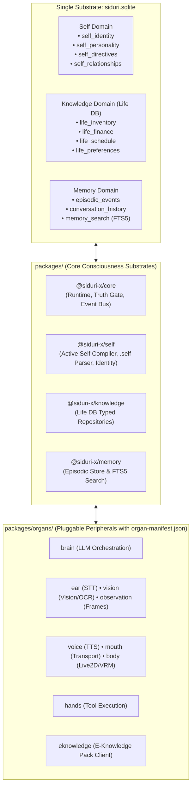
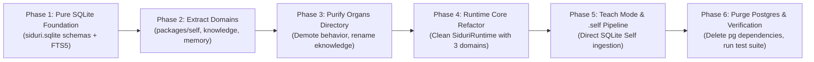

# Phased Engineering Roadmap: Clean Architecture (Zero-Baggage, Pure SQLite)

> **Status:** Canonical Clean Roadmap  
> **Philosophy:** Zero backward compatibility compromises. Complete eradication of PostgreSQL. Pure architectural boundaries.  
> **Substrates:** Single unified `siduri.sqlite` (SQLite WAL mode + FTS5), `@vxnus/e-hub` for external packs.  
> **Target Hierarchy:**  
> - **Top-Level Domains:** `packages/core`, `packages/self`, `packages/knowledge`, `packages/memory`  
> - **Peripheral Organs:** `packages/organs/{brain, ear, voice, mouth, vision, hands, body, observation, eknowledge}`  

---

## 1. Architectural Target Blueprint



---

## 2. Phase Overview



---

## Phase 1: Pure SQLite Foundation & FTS5 (`siduri.sqlite`)

**Goal:** Establish the unified SQLite database schema for all three persistent domains (`Self`, `Knowledge/Life DB`, and `Memory`) with built-in FTS5 full-text search, replacing PostgreSQL completely.

### 1.1 Unified Database Schema Setup
* **File:** `packages/core/src/database.ts` (or `packages/core/src/sqlite-manager.ts`)
* **Tables Created in `siduri.sqlite`:**
  ```sql
  -- ========================================================
  -- 1. SELF DOMAIN (Who am I?)
  -- ========================================================
  CREATE TABLE IF NOT EXISTS self_identity (
    companion_id TEXT PRIMARY KEY,
    name TEXT NOT NULL,
    archetype TEXT,
    version TEXT NOT NULL,
    updated_at TIMESTAMP DEFAULT CURRENT_TIMESTAMP
  );

  CREATE TABLE IF NOT EXISTS self_personality (
    companion_id TEXT PRIMARY KEY,
    warmth REAL NOT NULL DEFAULT 0.5,
    formality REAL NOT NULL DEFAULT 0.5,
    sarcasm REAL NOT NULL DEFAULT 0.5,
    verbosity REAL NOT NULL DEFAULT 0.5,
    curiosity REAL NOT NULL DEFAULT 0.5,
    updated_at TIMESTAMP DEFAULT CURRENT_TIMESTAMP
  );

  CREATE TABLE IF NOT EXISTS self_directives (
    id TEXT PRIMARY KEY,
    companion_id TEXT NOT NULL,
    priority INTEGER NOT NULL DEFAULT 50,
    directive TEXT NOT NULL,
    status TEXT NOT NULL DEFAULT 'ACTIVE', -- 'ACTIVE' | 'DISABLED' | 'SUPERSEDED'
    category TEXT NOT NULL DEFAULT 'behavioral',
    supersedes_id TEXT,
    created_at TIMESTAMP DEFAULT CURRENT_TIMESTAMP
  );

  CREATE TABLE IF NOT EXISTS self_relationships (
    companion_id TEXT NOT NULL,
    entity_id TEXT NOT NULL, -- e.g. "actor:kur"
    entity_type TEXT NOT NULL,
    trust_score REAL NOT NULL DEFAULT 0.5,
    familiarity REAL NOT NULL DEFAULT 0.5,
    interaction_conventions JSON,
    PRIMARY KEY (companion_id, entity_id)
  );

  -- ========================================================
  -- 2. KNOWLEDGE DOMAIN: LIFE DATABASE (What do I know?)
  -- ========================================================
  CREATE TABLE IF NOT EXISTS life_inventory (
    id TEXT PRIMARY KEY,
    companion_id TEXT NOT NULL,
    domain TEXT NOT NULL, -- 'gaming', 'hardware', 'subscriptions'
    entity_name TEXT NOT NULL,
    properties JSON NOT NULL,
    updated_at TIMESTAMP DEFAULT CURRENT_TIMESTAMP
  );

  CREATE TABLE IF NOT EXISTS life_finance (
    id TEXT PRIMARY KEY,
    companion_id TEXT NOT NULL,
    category TEXT NOT NULL,
    amount REAL NOT NULL,
    currency TEXT NOT NULL DEFAULT 'USD',
    timestamp TIMESTAMP DEFAULT CURRENT_TIMESTAMP,
    metadata JSON
  );

  CREATE TABLE IF NOT EXISTS life_schedule (
    id TEXT PRIMARY KEY,
    companion_id TEXT NOT NULL,
    title TEXT NOT NULL,
    start_time TIMESTAMP NOT NULL,
    end_time TIMESTAMP,
    is_recurring BOOLEAN DEFAULT 0,
    status TEXT NOT NULL DEFAULT 'active'
  );

  CREATE TABLE IF NOT EXISTS life_preferences (
    id TEXT PRIMARY KEY,
    companion_id TEXT NOT NULL,
    preference_key TEXT NOT NULL,
    preference_value TEXT NOT NULL,
    category TEXT NOT NULL,
    updated_at TIMESTAMP DEFAULT CURRENT_TIMESTAMP
  );

  -- ========================================================
  -- 3. MEMORY DOMAIN: EPISODIC & EVIDENCE (What happened?)
  -- ========================================================
  CREATE TABLE IF NOT EXISTS memory_events (
    id TEXT PRIMARY KEY,
    companion_id TEXT NOT NULL,
    source_type TEXT NOT NULL, -- 'chat_turn', 'tool_result', 'sensory'
    occurred_at TIMESTAMP DEFAULT CURRENT_TIMESTAMP,
    payload JSON NOT NULL
  );

  CREATE TABLE IF NOT EXISTS memory_claims (
    id TEXT PRIMARY KEY,
    companion_id TEXT NOT NULL,
    subject TEXT NOT NULL,
    predicate TEXT NOT NULL,
    value TEXT NOT NULL,
    status TEXT NOT NULL DEFAULT 'APPROVED',
    confidence REAL NOT NULL DEFAULT 1.0,
    valid_from TIMESTAMP,
    valid_until TIMESTAMP,
    evidence JSON,
    asserted_at TIMESTAMP DEFAULT CURRENT_TIMESTAMP
  );

  -- FTS5 Full-Text Search Virtual Table for Memory Claims
  CREATE VIRTUAL TABLE IF NOT EXISTS memory_search USING fts5(
    claim_id UNINDEXED,
    subject,
    predicate,
    value,
    content='memory_claims',
    content_rowid='rowid'
  );

  -- Triggers to keep FTS5 synchronized automatically
  CREATE TRIGGER IF NOT EXISTS memory_claims_ai AFTER INSERT ON memory_claims BEGIN
    INSERT INTO memory_search(rowid, claim_id, subject, predicate, value)
    VALUES (new.rowid, new.id, new.subject, new.predicate, new.value);
  END;

  CREATE TRIGGER IF NOT EXISTS memory_claims_ad AFTER DELETE ON memory_claims BEGIN
    INSERT INTO memory_search(memory_search, rowid, claim_id, subject, predicate, value)
    VALUES('delete', old.rowid, old.id, old.subject, old.predicate, old.value);
  END;

  CREATE TRIGGER IF NOT EXISTS memory_claims_au AFTER UPDATE ON memory_claims BEGIN
    INSERT INTO memory_search(memory_search, rowid, claim_id, subject, predicate, value)
    VALUES('delete', old.rowid, old.id, old.subject, old.predicate, old.value);
    INSERT INTO memory_search(rowid, claim_id, subject, predicate, value)
    VALUES (new.rowid, new.id, new.subject, new.predicate, new.value);
  END;
  ```

---

## Phase 2: Extract & Establish Core Domain Packages

**Goal:** Establish `packages/self`, `packages/knowledge`, and `packages/memory` as first-class domain packages directly under `packages/`.

### 2.1 Create `@siduri-x/self` (`packages/self`)
* **Responsibilities:**
  - `SelfRepository`: Reads/writes identity, personality sliders, directional relationships, and directives in `siduri.sqlite`.
  - `ActiveSelfCompiler`: Merged from old `@siduri-x/behavior`. Projects active traits and winning directives into `<active_self>` system prompt tokens.
  - `SelfPackageParser`: Parses and validates `.self` YAML bundles.
  - `scanDirective`: Safety scanner for prompt injection defense.

### 2.2 Rebuild `@siduri-x/knowledge` (`packages/knowledge`)
* **Responsibilities:**
  - Replaces external pack fetching with **Internal Sovereign Life DB**.
  - Provides typed repositories: `InventoryRepo`, `FinanceRepo`, `ScheduleRepo`, `PreferencesRepo`.
  - Exposes `queryLifeContext(queryText: string): Promise<LifeContextResult>`.

### 2.3 Rebuild `@siduri-x/memory` (`packages/memory`)
* **Responsibilities:**
  - Pure SQLite FTS5 implementation replacing `PostgresMemoryOrgan`.
  - Methods: `recordEvent()`, `searchClaims(query: string, limit?: number)`, `proposeClaim()`, `approveClaim()`.
  - No behavioral directives, no personality storage, no PostgreSQL client dependencies.

---

## Phase 3: Purify the Organs Directory (`packages/organs/`)

**Goal:** Ensure `packages/organs/` contains *only* true pluggable I/O peripherals with `organ-manifest.json`.

### 3.1 Directory Restructuring
1. **Delete `packages/organs/behavior/`:** Logic already moved into `packages/self`.
2. **Move `packages/organs/memory/`** $\rightarrow$ `packages/memory/`.
3. **Move `packages/organs/knowledge/`** $\rightarrow$ `packages/knowledge/` (Life DB).
4. **Create `packages/organs/eknowledge/`:**
   - Houses the external E Knowledge Pack client (`EKnowledgeAdapter`).
   - Pure peripheral organ: queries `@vxnus/e-knowledge` packs and É Hub remote APIs.
   - Preserves SSRF validation and citation generation.

### 3.2 Update `architecture-boundary.test.ts`
* **File:** `packages/core/src/architecture-boundary.test.ts`
* **Updated `EXPECTED_ORGANS`:**
  ```typescript
  const EXPECTED_ORGANS = [
    { dir: 'brain', name: '@siduri-x/brain', organType: 'brain', configKey: 'brain' },
    { dir: 'ear', name: '@siduri-x/ear', organType: 'ear', configKey: 'ear' },
    { dir: 'voice', name: '@siduri-x/voice', organType: 'voice', configKey: 'voice' },
    { dir: 'mouth', name: '@siduri-x/mouth', organType: 'mouth', configKey: 'mouth' },
    { dir: 'vision', name: '@siduri-x/vision', organType: 'vision', configKey: 'vision' },
    { dir: 'hands', name: '@siduri-x/hands', organType: 'hands', configKey: 'hands' },
    { dir: 'body', name: '@siduri-x/body', organType: 'body', configKey: 'body' },
    { dir: 'observation', name: '@siduri-x/observation', organType: 'observation', configKey: 'observation' },
    { dir: 'eknowledge', name: '@siduri-x/eknowledge', organType: 'eknowledge', configKey: 'eknowledge' },
  ];
  ```

---

## Phase 4: Core Runtime Refactor (`@siduri-x/core`)

**Goal:** Simplify `SiduriRuntime` to coordinate the 3 core substrates, the Truth Gate, and pluggable organs.

### 4.1 Update `SiduriRuntime` Class
* **File:** `packages/core/src/runtime.ts`
```typescript
export class SiduriRuntime {
  public id: string;
  public config: SiduriRuntimeConfig;

  // 1. The Core Continuity Substrates (All backed by siduri.sqlite)
  public self: SelfRepository;
  public knowledge: LifeDatabase;
  public memory: EpisodicMemoryStore;

  // 2. The Immutable Governance Boundary
  public gating: ResponseGatingEngine; // Truth Gate
  public actionPolicy: ActionPolicyEngine;

  // 3. Pluggable Peripheral Organs
  public brain: BrainOrgan;
  public ear?: EarOrgan;
  public voice?: VoiceOrgan;
  public mouth?: MouthOrgan;
  public vision?: VisionOrgan;
  public hands?: HandsOrgan;
  public body?: BodyOrgan;
  public observation?: ObservationOrgan;
  public externalKnowledge?: EKnowledgeOrgan;
}
```

### 4.2 Streamline `retrieveRuntimeContext`
* **File:** `packages/core/src/context-retriever.ts`
* In a single parallel pass:
  1. `self.getActiveSelf()` $\rightarrow$ Active identity, personality sliders, and directives.
  2. `knowledge.searchLifeContext(text)` $\rightarrow$ User's sovereign facts (finances, inventory).
  3. `externalKnowledge.search(text)` $\rightarrow$ External cited lore / technical documentation.
  4. `memory.searchClaims(text)` $\rightarrow$ Relevant past conversational episodes via SQLite FTS5.

---

## Phase 5: Teach Mode & `.self` Ingestion Pipeline

**Goal:** Implement the clean `.self` file upload and Teach Mode batch review directly into `Self`.

### 5.1 Ingestion Flow
1. User uploads `companion.self` via Teach Mode.
2. `packages/self` validates schema and runs `scanDirective`.
3. UI presents the interactive batch proposal card.
4. User selects approved directives and clicks **"Install Self"**.
5. The Truth Gate writes approved identity and directives directly into `siduri.sqlite` table `self_directives`.

---

## Phase 6: Purge PostgreSQL & End-to-End Verification

**Goal:** Completely remove PostgreSQL packages and verify the entire clean codebase.

### 6.1 Remove PostgreSQL Dependencies
* Run in root:
  ```bash
  pnpm remove pg @types/pg --recursive
  ```
* Delete all `.sql` PostgreSQL migration files in `@siduri-x/memory`.

### 6.2 Full Verification Suite
1. **Build & Typecheck:**
   ```bash
   pnpm run build
   pnpm run typecheck
   ```
2. **Execute Boundary & Unit Tests:**
   ```bash
   pnpm --filter @siduri-x/core test
   pnpm --filter @siduri-x/self test
   pnpm --filter @siduri-x/knowledge test
   pnpm --filter @siduri-x/memory test
   ```
3. **Run API Integration & SSRF Tests:**
   ```bash
   pnpm --filter @siduri-x/api test
   ```
4. **Smoke Test Single Binary:**
   - Launch runtime with zero external database dependencies.
   - Verify `siduri.sqlite` is automatically initialized with all domains in < 20ms.
