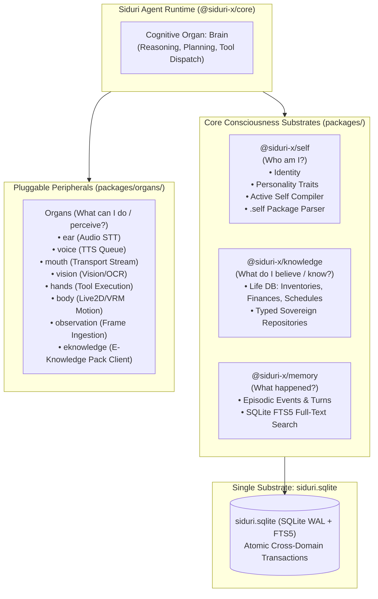

# Siduri-X Architecture Blueprint: Self, Organs, Knowledge & Memory

> **Status:** Architecture Blueprint & Canonical Clean Specification  
> **Philosophy:** Zero backward compatibility compromises. Complete eradication of PostgreSQL. Pure architectural boundaries.  
> **Target Subsystems:** `@siduri-x/core`, `@siduri-x/self`, `@siduri-x/knowledge`, `@siduri-x/memory`, `siduri.sqlite`, `@vxnus/e-hub`  
> **Source RFCs:**  
> - [RFC: Siduri-X Self, Organs, Knowledge, and Memory Architecture](file:///home/zagin/Projects/vxnus-studio/projects/siduri-x/docs/rfc/rfc-siduri-self-organ-knowledge.md)  
> - [RFC: Dynamic Behavior Delivery & The `.self` Asset Specification](file:///home/zagin/Projects/vxnus-studio/projects/siduri-x/docs/rfc/rfc-dynamic-behavior-self.md)  
> - [RFC: The Life Database Specification & User Data Sovereignty](file:///home/zagin/Projects/vxnus-studio/projects/siduri-x/docs/rfc/rfc-life-database.md)  

---

## 1. Executive Summary

In legacy AI companion systems (and earlier iterations of Siduri-X), the persistent store called **"Memory"** was forced to act as a monolithic dumping ground for:
* Core identity facts (*"My name is Siduri"*)
* Volatile conversational history (*"Kur said hello yesterday"*)
* Personal user records (*"Kur's budget is $500"*)
* Relational tendencies (*"Tease Kur when talking about rust types"*)
* External domain facts (*"React 19 released Server Components"*)

This conflation caused severe architectural pathologies: **semantic overload**, **numerical hallucination**, **unauthorized personality drift**, and **loss of user data sovereignty**.

This documentation suite establishes the **canonical clean architecture** for Siduri-X:



---

## 2. The Four Fundamental Questions

| Domain | Ontological Question | Primary Characteristics | Mutability & Stability |
| :--- | :--- | :--- | :--- |
| **Self** | **Who am I?** | Identity, core personality traits, behavioral dispositions, directional relational stance. | **Ultra-Stable.** Changes rarely, explicitly, and deliberately under strict governance. |
| **Knowledge** | **What do I believe / know?** | Grounded truth. Contains internal user reality (**Life DB**: finances, inventory, schedules, preferences). | **Factual & Current.** Changes when reality changes, maintaining strict provenance. |
| **Memory** | **What happened?** | Historical stream of experiences, episodic dialogue events, and raw evidence. | **Historical.** Immutable past events subject to summarization, decay, or retention compaction. |
| **Organs** | **What can I do / perceive?** | Swappable functional capabilities (Brain, Voice, Ear, Vision, Body, Hands, Mouth, E-Knowledge). | **Modular / Pluggable.** Can be swapped or upgraded without changing identity. |

---

## 3. Physical Storage Mapping: Pure SQLite (`siduri.sqlite`)

We explicitly reject PostgreSQL and micro-database fragmentation. All persistent state lives in a single, high-performance, local-first database:

```text
┌────────────────────────────────────────────────────────────┐
│                       siduri.sqlite                        │
│             (SQLite in WAL Mode + FTS5 Virtual Tables)     │
├──────────────────────────────┬─────────────────────────────┤
│            SELF              │          KNOWLEDGE          │
│ • self_identity              │ • life_inventory            │
│ • self_personality           │ • life_finance              │
│ • self_directives            │ • life_schedule             │
│ • self_relationships         │ • life_preferences          │
├──────────────────────────────┴─────────────────────────────┤
│                           MEMORY                           │
│ • memory_events (raw episodic history)                     │
│ • memory_claims (asserted past claims)                     │
│ • memory_search (FTS5 BM25 indexed claim search)           │
└────────────────────────────────────────────────────────────┘
```

### Why Pure SQLite is Superior to PostgreSQL for Siduri:
1. **Zero External Dependencies:** Eliminates Docker, background daemons, port clashes, and connection pool lifecycle overhead.
2. **Sub-millisecond Latency:** In-memory pointer calls (<0.05ms) versus TCP/socket serialization (1–5ms).
3. **Atomic Cross-Domain Transactions:** A single turn can atomically record an episodic event in `Memory`, update an inventory balance in `Knowledge`, and adjust relational familiarity in `Self` within one SQLite transaction.
4. **Absolute Data Sovereignty:** The user owns a single portable file (`siduri.sqlite`). Backing up or moving Siduri is trivial.

---

## 4. Documentation Index

This directory contains the exhaustive specifications and implementation plans for this architecture:

1. [**01. Domain Architecture & Contracts**](file:///home/zagin/Projects/vxnus-studio/projects/siduri-x/docs/self-organ-knowledge/01-domain-architecture.md)  
   Detailed contracts and interfaces for `Self`, `Knowledge` (Life DB), `Memory`, `Organs`, and the `Truth Gate`.

2. [**02. The `.self` Asset Specification & Teach Mode**](file:///home/zagin/Projects/vxnus-studio/projects/siduri-x/docs/self-organ-knowledge/02-self-asset-and-teach-mode.md)  
   How users install third-party character ethos and behaviors via signed `.self` asset files, governed by Teach Mode's batch review card, without risking prompt injection.

3. [**03. Phased Engineering Roadmap (Clean Architecture)**](file:///home/zagin/Projects/vxnus-studio/projects/siduri-x/docs/self-organ-knowledge/03-phased-migration-plan.md)  
   The complete 6-phase implementation roadmap with discrete file-level tasks, database schemas, and verification criteria.
